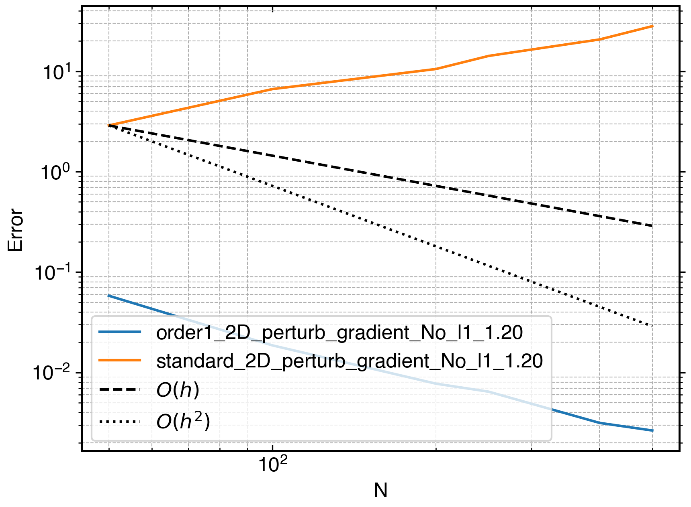

# pysphApproximator
Tool to test SPH approximation convergence

The UI of the application is simple and self explanatory.

It uses only the QuinticSpline kernel.

The user can select an SPH approximation present in the list or provide an
approximation. The approximation should be coded using the
[PySPH](https://github.com/pypr/pysph) framework. The code should have two
function.

    get_equations(dest, sources, derv=0, dim=1):
        ...

and

    get_props():
        ...

The `get_equation` function return a list of SPH
[Equations](https://pysph.readthedocs.io/en/latest/design/equations.html).
and `get_props` returns a list of properties required in the particle
array. Users can use `Edit code` option to edit their code. In case you
edit a custom code, it creates a copy of your passed code to a local copy
and that is updated while editing.

The rest is pretty simple now.

- `Scaling parameter`: The scaling factor for the kernel to use. As is is
  seen that the increasing this value reduces the accuracy.
- `Problem dimension`: Whether to run in 1D, 2D, or 3D.
- `Mesh kind`: The kind of particle distribution. The `No` is a cartesian
  mesh, `perturb` denotes the randomly perturbed mesh, and `pack` is the
  packed particle distribution.
- `Fraction`: It sets the fraction of the particle spacing to set as
  maximum perturbation. So, 0.1 means 10% perturbation.
- `Operator`: The discretization we are comparing approximated the
  function, gradient, Laplacian or the divergence.
- `Is periodic`: Should we consider periodicity or not?
- `Norm`: The error norm to use for evaluation.

The program simulates the for `[50, 100, 200, 250, 400, 500]` resolution in
a `[1X1]` domain.

Once we have a solution, the `plot` button activates. We can choose to plot
by clicking on `plot`.

The `render` button will plot the particle distribution in the
[mayavi](https://github.com/enthought/mayavi) viewer.

Notice! we have a reset button at the left bottom corner.

So the nice thing about this program is that, we can run it on different
combination e.g changing approximation, periodicity of domain. All the
results are saved and `plot` will compare them as shown below

So the plot shows that the second order approximation is first order if
the domain is not periodic.

Now, one can use `reset` button to clear all the previous run cases to begin a new
comparison. However, using the `remove` button specific runs can be removed.

All this runs on [PySPH](https://github.com/pypr/pysph), So the speed is
incredible.

